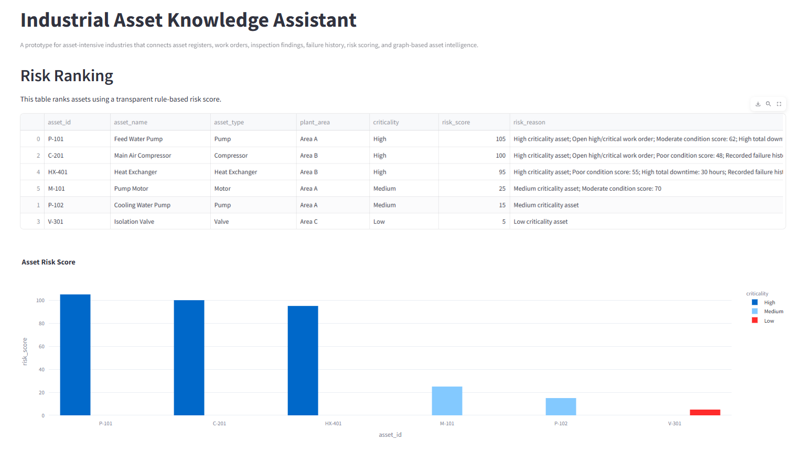
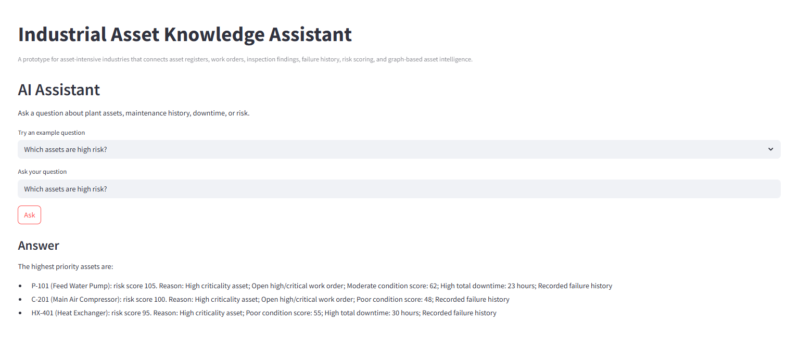

# Industrial Asset Intelligence RAG Demo

This is a small data science and AI prototype for industrial asset management. The project connects asset registers, work orders, inspection findings, failure events, risk scoring, and a simple assistant interface into one Streamlit dashboard.

I built this project to explore how AI, data analysis, graph-based asset modelling, and RAG-style question answering can support asset-intensive industries such as mining, LNG, oil and gas, power, utilities, and process plants.

## Project Goal

Industrial companies often manage large volumes of asset information across spreadsheets, maintenance systems, inspection reports, engineering documents, and shutdown plans.

This project demonstrates a simplified version of an asset intelligence system that can:

* Combine asset, maintenance, inspection, and failure data
* Rank assets using transparent risk scoring
* Show maintenance and failure history for each asset
* Connect assets to work orders, inspections, and failures using a knowledge graph structure
* Provide a basic assistant interface for asking questions about asset risk and maintenance history

## Features

### 1. Asset Overview

Shows key plant-level metrics:

* Total assets
* High-criticality assets
* Open work orders
* Total downtime hours
* Asset count by equipment type

### 2. Risk Ranking

Ranks assets using a transparent rule-based risk score.

The risk score considers:

* Asset criticality
* Open high-priority or critical work orders
* Poor inspection condition scores
* Total downtime
* Failure history

Each risk score includes a reason, so the result is explainable rather than a black-box prediction.

### 3. Asset Detail View

Allows the user to select an asset and view:

* Asset information
* Risk explanation
* Work order history
* Inspection findings
* Failure events

### 4. Knowledge Graph

Creates a simple graph connecting:

* Assets
* Work orders
* Inspections
* Failure events
* Related equipment

Example relationships:

```text
Asset -> HAS_WORK_ORDER -> Work Order
Asset -> HAS_INSPECTION -> Inspection
Asset -> HAD_FAILURE -> Failure Event
Asset -> CONNECTED_TO -> Related Asset
```

### 5. AI Assistant

Includes a simple assistant interface that can answer questions such as:

```text
Which assets are high risk?
Why is C-201 high risk?
Show maintenance history of P-101.
Which assets caused the most downtime?
Which assets need urgent attention?
```

The current version uses deterministic Python logic over structured data. Future versions can extend this into a proper RAG system using inspection notes, maintenance documents, embeddings, and source-backed answers.

## Screenshots

### Asset Overview


### Risk Ranking



### AI Assistant



### Knowledge Graph


## Tech Stack

* Python
* Pandas
* Streamlit
* Plotly
* NetworkX
* Matplotlib
* CSV-based asset and maintenance data

## Project Structure

```text
asset-intelligence-rag-demo/
│
├── data/
│   ├── assets.csv
│   ├── work_orders.csv
│   ├── inspections.csv
│   └── failure_events.csv
│
├── docs/
│   └── screenshots/
│       ├── asset_overview.png
│       ├── risk_ranking.png
│       ├── ai_assistant.png
│       └── knowledge_graph.png
│
├── app.py
├── requirements.txt
├── README.md
└── .gitignore
```

## Data Used

The project uses small synthetic sample data for demonstration purposes.

The sample dataset includes:

* Asset register
* Maintenance work orders
* Inspection findings
* Failure events
* Downtime and cost information

No real company or operational data is used.

## How to Run

Clone the repository:

```bash
git clone https://github.com/ra-onez/asset-intelligence-rag-demo.git
cd asset-intelligence-rag-demo
```

Create a virtual environment:

```bash
python -m venv .venv
```

Activate the environment on Windows:

```bash
.venv\Scripts\activate
```

Install dependencies:

```bash
pip install -r requirements.txt
```

Run the Streamlit app:

```bash
streamlit run app.py
```

Open the local URL shown in the terminal, usually:

```text
http://localhost:8501
```

## Why This Project Matters

Asset-intensive industries depend on reliable equipment, maintenance planning, inspection quality, and risk visibility. However, asset data is often fragmented across multiple systems and documents.

This prototype explores how data science and AI can help engineers and maintenance teams answer practical questions such as:

* Which assets need urgent attention?
* Why is an asset considered high risk?
* What failures have occurred in the past?
* Which work orders are still open?
* Which assets caused the most downtime?
* How can asset knowledge be connected and made easier to search?

## Future Improvements

Planned improvements include:

* Add proper RAG over maintenance and inspection documents
* Use ChromaDB or FAISS for vector search
* Add source-backed answers for the AI assistant
* Move the knowledge graph to Neo4j
* Add predictive maintenance modelling
* Add shutdown planning and schedule-risk analysis
* Add more realistic asset hierarchy and equipment relationships
* Add Power BI or advanced dashboard export
* Add Docker support for easier deployment

## Author

Rahul Chaudhary
Master of Data Science, University of Western Australia
B.Tech Chemical Engineering, IIT Madras
